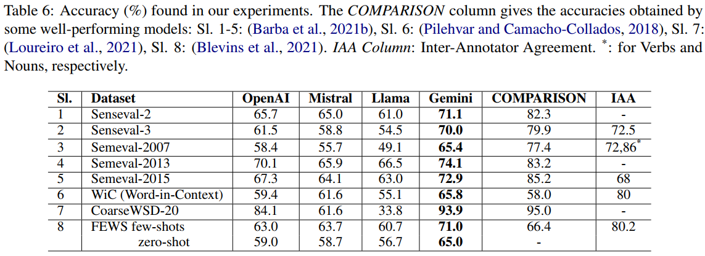

# 📊 **On Functional Competence of LLMs for Linguistic Disambiguation**

**Author(s)**: Raihan Kibria, Sheikh Intiser Uddin Dipta, Muhammad Abdullah Adnan  
**Published in**: CoNLL  
**Year**: 2024


## 📝 **Abstract**

We study some Large Language Models to explore their deficiencies in resolving sense ambiguities. In this connection, we evaluate their performance on well-known word sense disambiguation datasets. Word Sense Disambiguation (WSD) has been a long-standing NLP problem, which has given rise to many evaluation datasets and models over the decades. Recently the emergence of Large Language Models (LLM) raises much hope in improving accuracy. In this work, we evaluate word sense disambiguation capabilities of four LLMs: OpenAI's ChatGPT-3.5, Mistral's 7b parameter model, Meta's Llama 70b, and Google's Gemini Pro. We evaluate many well-established datasets containing a variety of texts and senses on these. After observing the performances of some datasets, we selectively study some failure cases and identify the reasons for failures. We explore human judgments that would correct these failures. Our findings suggest that many failure cases are related to a lack of world knowledge and the reasoning to amalgamate this knowledge rather than the lack of linguistic knowledge. We categorize the judgments so that the next generation of LLMs can improve by incorporating deeper world knowledge and reasoning. We conclude that word sense disambiguation could serve as a guide for probing the reasoning power of LLMs to measure their functional competency. We also list the accuracy of these datasets. We find that on many occasions, accuracy drops to below 70%, which is much less than that of well-performing existing models.

---

## 📈 **Results**



---

## 🔬 **Reproducing the Results**

To reproduce the experiments, refer to the README files in each folder, where you'll find specific instructions for different datasets and models.


### **Experiment Configurations**

Set your own API keys for Gemini, LLama, Mistral and OpenAI in Google Colab.

---

## 🔍 **Citations**

If you use this code in your research, please cite:

```bibtex
@inproceedings{kibria2024functional,
  title={On Functional Competence of LLMs for Linguistic Disambiguation},
  author={Kibria, Raihan and Dipta, Sheikh and Adnan, Muhammad},
  booktitle={Proceedings of the 28th Conference on Computational Natural Language Learning},
  pages={143--160},
  year={2024}
}
```

---

## 🗂 **Project Structure**

```bash
├───gemini
│   ├───coarseWSD-20-gemini
│   ├───fews
│   ├───unified_framework
│   └───wic
├───images
├───llama
│   ├───coarseWSD-20-Llama
│   ├───fews
│   ├───unified_framework
│   └───wic
├───mistral
│   ├───coarseWSD-20-mistral
│   ├───fews
│   ├───unified_framework
│   └───wic
└───open-ai
    ├───coarseWSD-20-openAI
    ├───fews
    ├───unified_framework
    └───wic
```

---
